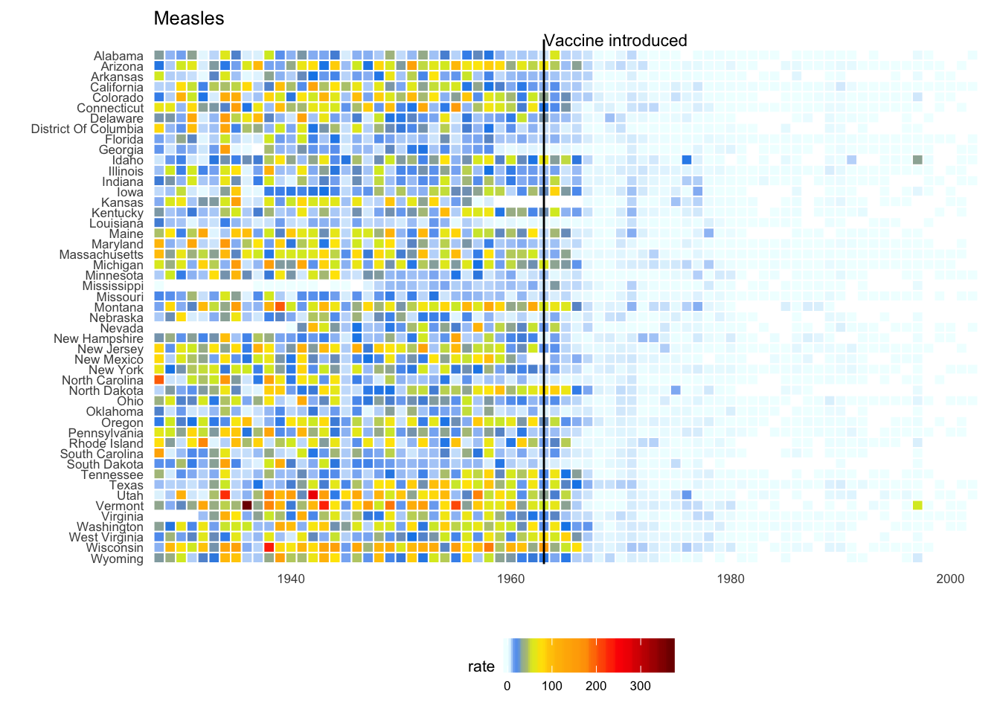

# Data Visualization in Bioinformatics (R)

<p align="left">
  
</p>

Plotting and data visualization are essential for effectively communicating bioinformatics findings, yet they are often treated as trivial tasks. In this course, we will showcase the power of a well-designed plot! We will cover key principles of effective visualization, work through examples ranging from basic to complex, and conclude with a hands-on workshop. By the end of the course, you will be able to create publication- or presentation-ready plots for your own research using R and ggplot2.

## Course Outline
- [Overview of visualization principles](https://docs.google.com/presentation/d/10yaNiSj0xnXUfj_YDEPh7uCYQiVjZ9AoAHwtbDrv3Wo/edit?usp=sharing)
- Get everyone set up with a functional version of RStudio (with necessary packages) and data 
- Introduction to ggplot
    - These can be found in the downloaded project folder
    - [Part I](https://github.com/redgar598/COSS_data_vis_R/blob/main/ggplot_intro.R)
    - [Part II](https://github.com/redgar598/COSS_data_vis_R/blob/main/ggplot_intro_part2.R)
- Hands on workshop to make plots of interest. I have listed a number of examples with different features. Choose one of interest to try and reproduce.


## RStudio Setup
### Using R in the Cloud  
[https://posit.cloud/](https://posit.cloud/)

1. Go to <a href="https://posit.cloud/" target="_blank">Posit Cloud</a> and create a free account using your Google, GitHub, or email login.  
2. Once you're logged in, click <strong>"New Project"</strong> → <strong>"From Git Repository"</strong>.  
3. In the <strong>"Git Repository URL"</strong> field, paste the following URL: https://github.com/redgar598/COSS_data_vis_R.git
4. This will create a cloud-based copy of the project, including all the materials you'll need for the hands-on portion of the workshop.

### Using R Locally with RStudio  

1. Open RStudio on your computer.  
2. Go to <strong>File</strong> → <strong>New Project</strong> → <strong>Version Control</strong> → <strong>Git</strong>.  
3. In the <strong>"Repository URL"</strong> field, paste: https://github.com/redgar598/COSS_data_vis_R.git
4. Choose a local folder where you want to save the project, then click <strong>Create Project</strong>.  
5. RStudio will clone the GitHub repository to your computer, and you'll be ready to work locally.


### Required Packages
```
# These are essential
install.packages("ggplot2")
install.packages("reshape2")
install.packages("gridExtra")

# These are fun and useful
install.packages("RColorBrewer")
install.packages("scales")
install.packages("dplyr")
```


---

## Data We Will Be Using for ggplot Introduction
We will be looking at gene expression data from mouse photoreceptors. There are samples from different developmental stages (E16,P2,P6,P10 and 4 weeks) and two mouse lines, a wildtype (wt) and knockouts for rod cell specific transcription factor (NrlKO). The gene expression and sample information data were collected from the Gene Expression Omnibus (GEO), under study ID [GSE4051](https://www.ncbi.nlm.nih.gov/geo/query/acc.cgi?acc=GSE4051).

For more information on the actual paper see the associated [publication](http://www.pnas.org/cgi/pmidlookup?view=long&pmid=16505381).

<p align="left">
  
    <figcaption> <sup>www.scientificanimations.com [<a href="https://creativecommons.org/licenses/by-sa/4.0">CC BY-SA 4.0</a>], <a href="https://commons.wikimedia.org/wiki/File:Photoreceptor_cell.jpg">via Wikimedia Commons</a></sup></figcaption>
</p>

---

## More ggplot examples to work through
Below are several examples of complex plots. Feel free to work through them on your own to see some techniques for developing presentation ready plots. 

### Differential expression
A common plot used to in computational biology to visualize the differential expression of a gene between conditions. 

<p align="left">
  
</p>


### Vaccination efficacy
This example is take from the [simply statistics blog](https://simplystatistics.org/posts/2019-08-28-you-can-replicate-almost-any-plot-with-ggplot2/). 

<p align="left">
  
</p>


### Patient mutations
The following example is for patient mutation data in relation of clinical factors. The provided code (taken from [stack overflow](https://stackoverflow.com/questions/34211735/r-how-to-allocate-screen-space-to-complex-ggplot-images)) generates data to make the plot. 

<p align="left">
  
</p>


### Crops over time
A stream plot from the farming data we were using
<p align="left">
  
</p>

### Big Foot Sightings
Plot the locations of big foot sightings on a map
<p align="left">
  
</p>


### Single-Cell UMAP
Uniform Manifold Approximation and Projection of single-cell expression data. Has a fancy black outline around all point. 
<p align="left">
  
</p>


### Additional Resources
[Effective Visual Communication for the Quantitative Scientist](https://ascpt.onlinelibrary.wiley.com/doi/full/10.1002/psp4.12455)
<br/>
[ggplot cheat sheet](https://rstudio.github.io/cheatsheets/data-visualization.pdf)
<br/>
[Points of View columns on data visualization](http://blogs.nature.com/methagora/2013/07/data-visualization-points-of-view.html)


Additional packages
```
install.packages("devtools") 
library(devtools)
install.packages("animation")
install.packages("gganimate-0.1.1.tar.gz", repos = NULL, type="source")
install.packages("gapminder")
```
