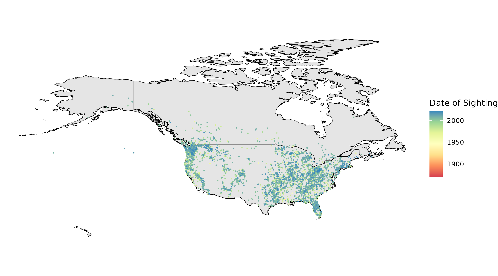

# Data Visualization in Bioinformatics (R)

<p align="left">
  
</p>

Plotting and data visualization are essential for effectively communicating bioinformatics findings, yet they are often treated as trivial tasks. In this course, we will showcase the power of a well-designed plot! We will cover key principles of effective visualization, work through examples ranging from basic to complex, and conclude with a hands-on workshop. By the end of the course, you will be able to create publication- or presentation-ready plots for your own research using R and ggplot2.

## Course Outline
- Get everyone set up with a functional version of RStudio (with necessary packages) and data 
- [Overview of visualization principles](https://docs.google.com/presentation/d/10yaNiSj0xnXUfj_YDEPh7uCYQiVjZ9AoAHwtbDrv3Wo/edit?usp=sharing)
- Introduction to ggplot
    - [Part I](https://github.com/redgar598/COSS_data_vis_R/blob/main/ggplot_intro.R)
    - [Part II](https://github.com/redgar598/COSS_data_vis_R/blob/main/ggplot_intro_part2.R)
- Hands on workshop to make plots of interest. I have listed a number of examples with different features. Choose one of interest to try and reproduce.


## RStudio Setup
Two options to get a functional RStudio with example data and necessary packages:

| Option                | Pro                                        | Con                                                                         |
|-----------------------|--------------------------------------------|-----------------------------------------------------------------------------|
| RStudio Local Install | Will be set to do further analysis at home | More difficult                                                              |
| RStudio Cloud         | Easy and has all packages available        | Limited in compute power, but can handle all examples                       |

<br/>


**Tips to Install RStudio and necessary packages locally**
    - First download [R](https://cran.r-project.org/) and then [R Studio](https://www.rstudio.com/products/rstudio/download/#download) to your local machine 
    - Then to get the data
        - *If you have git installed*, then in RStudio: Start a new project (file>new project), select Version Control, then git
            - Paste the repository url https://github.com/redgar598/eipp_data_viz.git
            - Once this has cloned load eipp_data_viz.Rproj
        - *Without git download* git repo as zip: [here](https://github.com/redgar598/eipp_data_viz) then hit "Clone or download"
            - Then within RStudio navigate to the folder and load eipp_data_viz.Rproj
    
    - Then after cloning from git or downloading the zip you need a few packages installed
    
```
# These are essential
install.packages("ggplot2")
install.packages("reshape2")
install.packages("gridExtra")


# These are fun and useful
install.packages("RColorBrewer")
install.packages("scales")
install.packages("rafalib")
install.packages("dplyr")
```


### R Projects
What even is "eipp_data_viz.Rproj" and why do you keep saying to load it? A complete explination is [here](https://www.tidyverse.org/articles/2017/12/workflow-vs-script/). But a project file is a quick and contained way to load the required paths to the data, and related scripts whereever they happen to be on your computer. What we are doing for this tutorial is a great example. Since many of you will work locally, the scripts for eipp_data_viz should run within the eipp_data_viz folder on your computer without having to specify exactly where on your computer you saved it. R Projects are a system to help with data reproducibility when using R.

<br/><br/>

## Data We Will Be Using for ggplot Introduction
We will be looking at gene expression data from mouse photoreceptors. There are samples from different developmental stages (E16,P2,P6,P10 and 4 weeks) and two mouse lines, a wildtype (wt) and knockouts for rod cell specific transcription factor (NrlKO). The gene expression and sample information data were collected from the Gene Expression Omnibus (GEO), under study ID [GSE4051](https://www.ncbi.nlm.nih.gov/geo/query/acc.cgi?acc=GSE4051).

For more information on the actual paper see the associated [publication](http://www.pnas.org/cgi/pmidlookup?view=long&pmid=16505381).

<p align="left">
  
    <figcaption> <sup>www.scientificanimations.com [<a href="https://creativecommons.org/licenses/by-sa/4.0">CC BY-SA 4.0</a>], <a href="https://commons.wikimedia.org/wiki/File:Photoreceptor_cell.jpg">via Wikimedia Commons</a></sup></figcaption>
</p>


___


<br/><br/>

## Extended ggplot
Below are several examples of complex plots. Feel free to work through them on your own to see some techniques for developing presentation ready plots. 

### Differential expression
A common plot used to in computational biology to visualize the differential expression of a gene between conditions. 

<p align="left">
  
</p>


### Vaccination efficacy
This example is take from the [simply statistics blog](https://simplystatistics.org/posts/2019-08-28-you-can-replicate-almost-any-plot-with-ggplot2/). 

<p align="left">
  
</p>


### Patient mutations
The following example is for patient mutation data in relation of clinical factors. The provided code (taken from [stack overflow](https://stackoverflow.com/questions/34211735/r-how-to-allocate-screen-space-to-complex-ggplot-images)) generates data to make the plot. 

<p align="left">
  
</p>


### Crops over time
A stream plot from the farming data we were using
<p align="left">
  
</p>

### Big Foot Sightings
Plot the locations of big foot sightings on a map
<p align="left">
  
</p>


### Additional Resources
[Effective Visual Communication for the Quantitative Scientist](https://ascpt.onlinelibrary.wiley.com/doi/full/10.1002/psp4.12455)
<br/>
[ggplot cheat sheet](https://rstudio.github.io/cheatsheets/data-visualization.pdf)
<br/>
[Points of View columns on data visualization](http://blogs.nature.com/methagora/2013/07/data-visualization-points-of-view.html)


```
install.packages("devtools") 
library(devtools)
install.packages("animation")
install.packages("gganimate-0.1.1.tar.gz", repos = NULL, type="source")
install.packages("gapminder")
```
